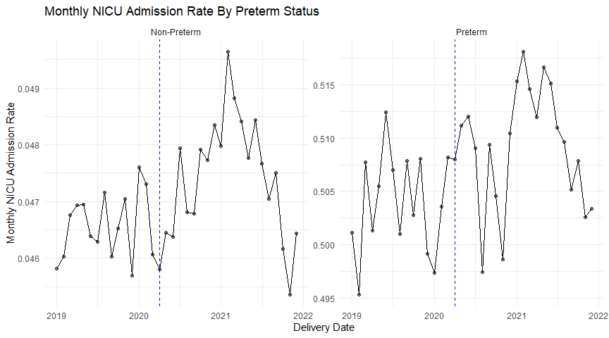
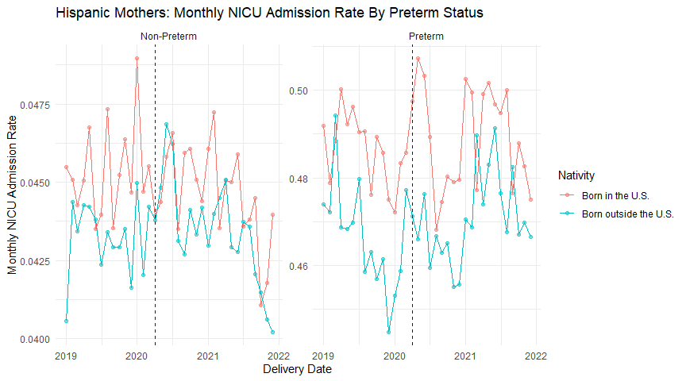

NBER Birth Data Practice
================

## Introduction & Scope

Hi all, this is some practice code I wrote in late October of 2023 to
help with gaining familiarity in applying R to an actual data set! I
included some of the work I was doing at the time with preterm birth and
NICU admit rates.

For this tutorial, you will need to start by downloading a few birth
data files from the CDC website:
<https://www.cdc.gov/nchs/data_access/vitalstatsonline.htm>  
  
Download years 2019-2021 from the “U.S. Data (.zip files)” header and keep track
of where you store them.

## Step 1; Clear current memory and load packages

``` r
rm(list = ls())  #Removes everything currently in the environment (so run this first!)

library(data.table)
library(plyr)
library(dplyr)
library(tidyverse)
library(lubridate)
```

## Step 2: Select which variables you want to load in (we’re only going to load relevant variables to conserve memory)

``` r
#I chose a random subset here, but you probably will want a lot more! To look at more variables, click on one
#of the User Guides from this website: https://www.cdc.gov/nchs/data_access/vitalstatsonline.htm

vars_of_interest = c("OEGest_Comb", "DOB_MM", "DOB_YY", "MEDUC", "MAGER", "MBSTATE_REC", "MRACEHISP", "AB_NICU")
```

## Step 3: Load the relevant data in (only looking at 2019-2021 here)

``` r
#Quick note about the CDC data; it's not standardized. Different years have different capitalization, hence the code
#below making it capitalized or not capitalized seemingly at random. I don't know why they did this, but looking at the
#actual csv can help you determine which case to use.

nber_2019 <- fread('nat2019us.csv', select = tolower(vars_of_interest))
nber_2020 <- fread('birth_2020_nber_us_v1.csv', select = vars_of_interest)
nber_2021 <- fread('nat2021us.csv', select = tolower(vars_of_interest))
#[Feel free to add more years here!]
```

## Step 4: Standardize the capitalization and merge

``` r
#I prefer lowercase, but the choice is yours!

nber_2020 <- nber_2020 %>% rename_with(tolower)  #Renaming 2020 to have lowercase variable names, like the others
#[Add more years here if needed]

nber_df <- rbind(nber_2019, nber_2020, nber_2021)  #Merging the three data frames together
#[Add more years here if needed]

rm(nber_2019, nber_2020, nber_2021)  #Now you should have one data frame left, with 11,047,364 obersvations
#[Add more years here if needed]
```

## Step 5: Data Manipulation (copied from previous projects, feel free to change)

``` r
nber_df <- nber_df %>% drop_na()  #Drop NA's; now 11,047,336 observations

nber_df <- nber_df %>%  #Fix the month variable to then make a delivery_date variable
  mutate(revised_month = ifelse(nber_df$dob_mm < 10, paste0('0', nber_df$dob_mm), nber_df$dob_mm))

nber_df <- nber_df %>%  #Make said delivery_date variable
  mutate(deliv_date = ym(paste0(nber_df$dob_yy, nber_df$revised_month)))


nber_df$race <- mapvalues(nber_df$mracehisp, from = 1:8,  #Map race values
                          to = c('White', "Black", 'AIAN', 'Asian', "NHOPI", 'More than One Race', 'Hispanic', 'Unknown or Not Stated'))

nber_df$race <- factor(nber_df$race,  #Order race values
                       levels = c('White', "Black", 'AIAN', 'Asian', "NHOPI", 'More than One Race', 'Hispanic', 'Unknown or Not Stated'))


nber_df$educ <- mapvalues(nber_df$meduc, from = 1:9,  #Map education values
                          to = c('8th grade or less', '9th through 12th grade with no diploma',
                                 'High school graduate or GED completed',  'Some college credit, but not a degree',
                                 'Associate degree', "Bachelor's degree", "Master's degree",
                                 'Doctorate or Professional Degree', 'Unknown'))

nber_df$educ <- factor(nber_df$educ,  #Order education values
                       levels = c('8th grade or less', '9th through 12th grade with no diploma',
                                                'High school graduate or GED completed',  'Some college credit, but not a degree',
                                                'Associate degree', "Bachelor's degree", "Master's degree",
                                                'Doctorate or Professional Degree', 'Unknown'))


nber_df$nativity <- mapvalues(nber_df$mbstate_rec, from = 1:3,  #Map nativity values
                              to = c('Born in the U.S. (50 US States)',
                                     'Born outside the U.S. (includes possessions)', 
                                     'Unknown'))

nber_df <- nber_df %>% mutate(preterm = ifelse(oegest_comb < 37, 1, 0)) #Make preterm variable

nber_df <- nber_df %>% mutate(early_preterm = ifelse(oegest_comb < 34, 1, 0)) #Make early_preterm variable

nber_df <- nber_df %>% mutate(late_preterm = ifelse(oegest_comb < 37 & oegest_comb >= 34, 1, 0)) #Make late_preterm variable

nber_df <- nber_df %>% select(-c("meduc", "mbstate_rec", "mracehisp", "revised_month"))  #Removes redundant variables]
```

## Step 6: Analyze!

``` r
#Now that everything is loaded, we can start analyzing the data! It's important to NOT change the original 
#data frame (nber_df) when doing this; instead make new data frames to change to any purpose.

#Making a new data frame, try and figure out what this does!
nicu_ptb <- nber_df %>%
  filter(ab_nicu != "U") %>%
  mutate(ab_nicu = ifelse((ab_nicu =='Y'),1, 0)) %>%
  group_by(deliv_date, preterm) %>%
  summarize(nic_rate = sum(ab_nicu) / n()) %>%
  mutate(preterm = ifelse((preterm == 0), 'Non-Preterm', 'Preterm'))

#Plotting it
ggplot(nicu_ptb, aes(deliv_date, nic_rate)) + 
  #making a separate graph for each value of 'preterm'
  facet_wrap(~preterm, scales = 'free') +
  #making points (alpha level makes it a tiny bit transparent)
  geom_point(alpha = 0.5) +
  #connects the points
  geom_line() +
  #adds a line at April 2020 (COVID!)
  geom_vline(xintercept = ym(202004), linetype = 'dashed', colour = "blue") +
  #adds labels
  xlab("Delivery Date") +
  ylab('Monthly NICU Admission Rate') +
  ggtitle('Monthly NICU Admission Rate By Preterm Status') +
  #changes the theme to look nicer
  theme_minimal()
```


Now we’re going to look at a specific race and add a separate variable
of interest -\> nativity!

``` r
nicu__ptb_hisp <- nber_df %>%
  filter(ab_nicu != "U", race == 'Hispanic', nativity != 'Unknown') %>%
  mutate(ab_nicu = ifelse((ab_nicu =='Y'),1, 0)) %>%
  #grouping by another variable -> look at how many more combinations that gives us!
  group_by(deliv_date, preterm, nativity) %>%
  summarize(nic_rate = sum(ab_nicu) / n()) %>%
  mutate(preterm = ifelse((preterm == 0), 'Non-Preterm', 'Preterm'))

#Plotting it! The plot may appear small on the side, so drag it out to make it bigger.
ggplot(nicu__ptb_hisp, aes(deliv_date, nic_rate, color = nativity )) + 
  facet_wrap(~preterm, scales = 'free') +
  geom_point(alpha = 0.5) +
  geom_line() +
  geom_vline(xintercept = ym(202004), linetype = 'dashed', colour = "blue") +
  xlab("Delivery Date") +
  ylab('Monthly NICU Admission Rate') +
  ggtitle('Hispanic Mothers: Monthly NICU Admission Rate By Preterm Status') +
  #shortens the legend a bit (the original names are longer) just for ease of viewing
  scale_color_discrete(name = 'Nativity', labels = c("Born in the U.S.", "Born outside the U.S."))+
  theme_minimal()
```



This plot above looks at Hispanic mothers and whether or not
fluctuations in NICU admission rates are similar in preterm and
non-preterm babies over time, by nativity.

If you have time, try and do this same thing for different racial
groups, maybe there is an interesting effect for a different group. Also
feel free to look at other variables (loaded in already or not - you can
always consult the code book!) And feel free to ask any questions you
have! I’ll try to help as much I can :D


